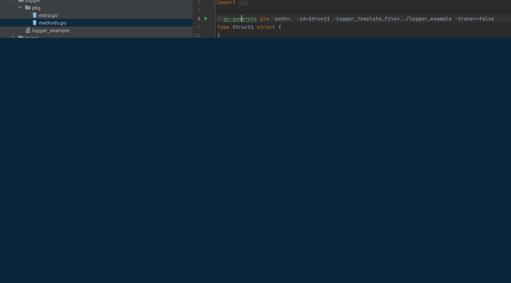

## Goal is to generate logger and tracer wraps around a certain struct 

## How to install
1) git clone git@github.com:hardstylez72/glw.git
 
2) cd glw
 
3) go build -o=$GOPATH/bin/glw

## basic  [templates](templates)
## example [templates](examples)

## Options

| flag                 |      example      |                description                 | optional |
|----------------------|:-----------------:|:------------------------------------------:|----------|
| path                 |         .         |             path to a package              | no       |
| id                   |    yourStruct     |                struct name                 | no       |
| logger_template_file | ./logger_template |        custom logger template file         | yes      |
| logger               |    true/false     | enables or disables logger file generation | yes       |
| tracer_template_file | ./tracer_template |        custom tracer template file         | yes       |
| tracer               |    true/false     | enables or disables tracer file generation | yes       |

# to disable logger or tracer wrapper generation write in comments "glw-no-logger" or "glw-no-tracer"

## How run examples
1) git clone git@github.com:hardstylez72/glw.git
2) cd glw
3) go mod tidy
4) go generate ./...